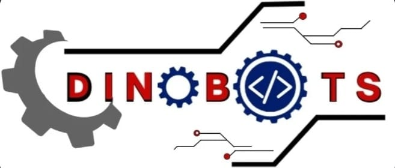
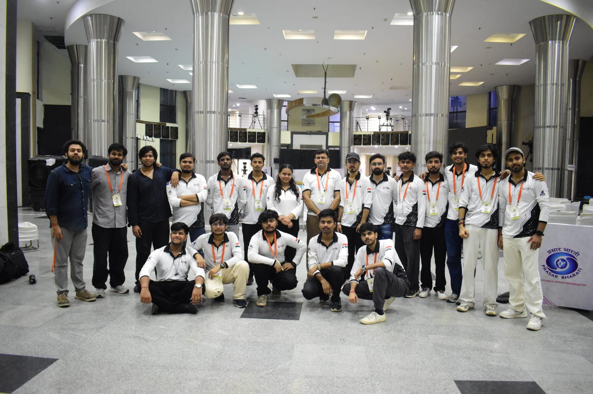
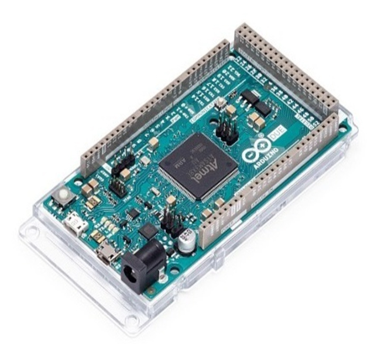
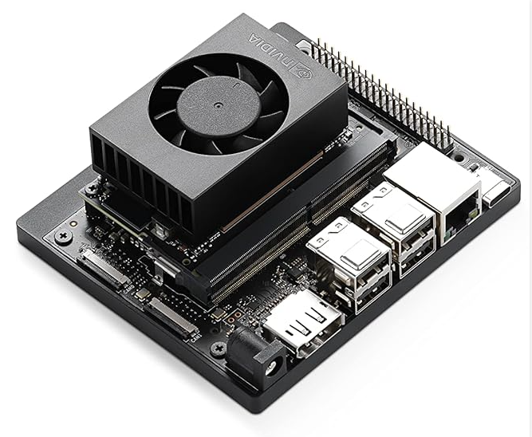
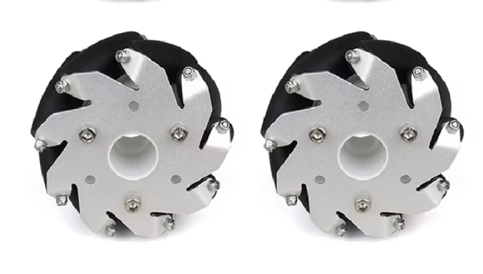
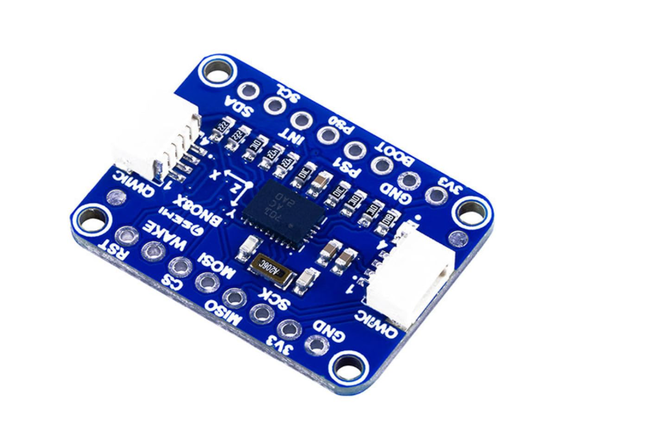
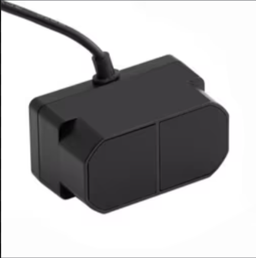

# ABU-Robocon-Work
This repository marks the contribution made by me in the overall journey of Robocon and how did we implemented different ideas into hardware reality. It contain all the methodology implemented by me and how did that helped in the overall dedvelopment of the autonomous bot.

<p align="center">
  
</p>

<h1 align="center">Team Dinobots(KIET Deemed To Be University) — Robocon Multi-MCU Autonomous Robot</h1>
<p align="center"><i>Built for DD Robocon | Mecanum-drive, FSM-based mission robot</i></p>

<p align="center">
  
  
  
  
  
</p>

---

## 📑 Table of Contents
- [About the Team](#about-the-team)
- [About DD Robocon](#about-dd-robocon)
- [Quick Start](#quick-start)
- [System Architecture](#system-architecture)
- [Hardware Setup](#hardware-setup)
- [Software / Firmware Build & Flash](#software--firmware-build--flash)
- [Running the Robot](#running-the-robot)
- [Missions](#missions)
- [Tech Stack](#tech-stack)
- [Repository Structure](#repository-structure)
- [License](#license)

---

## About the Team

<p align="center">
  
</p>

<!-- TODO: Replace with your team's story -->
We are a student robotics team competing in **DD Robocon**, building a fully autonomous, multi-MCU robot from the ground up — mechanical design, embedded firmware, control systems, and computer vision. This repository documents our robot's architecture, our mission logic, and everything needed to build, flash, and run the system.

> *We are Team Dinobots! we are fascinated by robots because they are reflection of ourselves. Bots shows us and our character and we foster on the reflection of ours in them*

---

## About DD Robocon

<p align="center">
  
  
  
  
</p>

<!-- TODO: 3-4 sentence intro to the event -->
**DD Robocon** is India's premier national-level robotics competition, serving as the official qualifier for the international ABU Robocon. For 2026, teams face the **"Kung Fu Quest"** theme, which challenges engineering students to build robots capable of martial arts-inspired agility and strategy. Competitors must operate a manual (R1) and an autonomous (R2) robot to assemble weapons in the Martial Club, independently navigate the booby-trapped Meihua Forest to collect Kung Fu Scrolls, and seamlessly combine physically to secure a winning line on a massive 3x3 Tic-Tac-Toe rack, achieving the ultimate "Kung Fu Master" victory.

---

## Quick Start

```bash
# Clone the repository
git clone https://github.com/<your-username>/<your-repo>.git
cd <your-repo>

# See build instructions per MCU below
```

| Component        | Board              | Role                                   |
|-------------------|---------------------|-----------------------------------------|
| Due A             | Arduino Due         | Primary FSM / mission logic controller, Outer loop motor control and Inner loop motor control(rear motors)        |
| Due B             | Arduino Due         | Inner Loop motor control, slave of DUE A(front motor control)                                                     |
| Due C             | Arduino Due         | Sensor Integration, SPI communication with DUE A, 4X1D distance Lidar integration                                 |
| Vision Unit       | Jetson Orin Super Nano    | CV pipeline, object detection, Meihua UI                                                                          |

---

## System Architecture
 
[](/ShashiBhushanSharma-debug/ABU-Robocon/blob/main/assets/architecture-diagram.png)
 
The robot runs a **four-board distributed control system**:
 
- **Due A (Master / Brain)** — mechanical-switch-based FSM for mission sequencing (`WEAPON`, `MEIHUA`, `TICTAC`), outer-loop kinematics, and inner-loop cascade PID for the rear motors
- **Due B (Slave)** — inner-loop PID for the front motors, commanded by Due A
- **Due C (Sensor Hub)** — polls 4x TFmini Plus distance LiDARs over UART at 500 Hz and a BNO085 IMU over SPI at 100 kHz, then relays fused data to Due A over a dedicated SPI link at 125 kHz — a clock rate arrived at through testing, since higher speeds introduced garbage values that couldn't be filtered out
- **Mega (Actuation)** — drives 5 pneumatic actuators through relays, reads 3 proximity sensors, and controls every servo on the R2 bot
- **Jetson Orin Nano (Vision)** — YOLO / DepthAI pipeline, streams detections to Due A over a dedicated UART link
**Inter-board communication:** UART between Due C ↔ Mega and Jetson ↔ Due A, SPI between Due C ↔ Due A, UART between Due A ↔ Due B. 

---

## Hardware Setup

1. **Chassis assembly** — mecanum wheel base, motor mounts
2. **Wiring** — motor drivers, encoders, IMU, proximity sensors, 1D distance lidars, Relays, Pneumatics (pressure)
3. **MCU interconnects** — UART/SPI wiring between Due A ↔ Due B/C ↔ Jetson
4. **Power distribution** — battery, regulators, fusing, Diodes, Capacitors

### Hardware Used

#### Arduino Due (32-bit ARM Cortex-M3)
<p align="center">
  
</p>

* **Why we used it:** The DD Robocon arena requires micro-second precision for motor control and multiple fast serial ports for inter-board communication. The Due's 84 MHz clock speed and multiple hardware UART/SPI buses made it the perfect backbone over standard 8-bit microcontrollers.
* **How we used it:** We deployed three Dues in a master-slave architecture. **Due A** acts as the brain (FSM and cascade PID master), **Due B** handles the inner PID loops for the front motors, and **Due C** manages high-speed SPI polling for the IMU and LiDAR arrays.

#### NVIDIA Jetson Orin Nano
<p align="center">
  
</p>

* **Why we used it:** The "Kung Fu Quest" theme requires detecting complex objects like the Meihua Forest poles and weapon racks on the fly. The Orin Nano provides massive edge AI computing power in a lightweight footprint, allowing us to run deep learning models without frame drops.
* **How we used it:** It runs our ROS2 (Humble) environment and YOLO vision pipelines. It takes feeds from the DepthAI cameras, processes bounding boxes and depth data, and streams alignment coordinates down to Due A via a dedicated UART link.

#### Mecanum Wheels & Drive System
<p align="center">
  
</p>

* **Why we used it:** Agility is everything when maneuvering through the booby-trapped Meihua Forest. Mecanum wheels provide holonomic, omnidirectional movement, allowing the bot to strafe sideways or rotate on its axis without needing space for traditional steering arcs.
* **How we used it:** Integrated into a custom-machined chassis and driven by high-torque DC motors. The kinematics equations are solved in real-time on FreeRTOS, mapping the X, Y, and Theta joystick/autonomous commands to individual wheel RPMs. 

#### BNO085 IMU & 4x1D Distance LiDARs
<p align="center">
  
  
</p>


* **Why we used it:** Pure wheel encoder odometry suffers from slip, especially on standard arena carpets. The BNO085 provides a highly stable, drift-free heading (using its internal sensor fusion), while the 1D LiDARs give absolute, millimeter-accurate distances to the arena walls and game elements.
* **How we used it:** Mounted on the perimeter of the bot and wired to Due C. The IMU ensures the bot stays perfectly straight during the `WEAPON` sequences, and the 1D LiDARs are the core of our `meihuaIrAlign()` positioning logic for scoring on the Tic-Tac-Toe rack.

### Bill of Materials (BOM)

| Part | Qty | Notes |
|------|-----|-------|
| Arduino Due | 3 | Due A (Master) / Due B / Due C |
| Jetson Orin Nano | 1 | Vision/compute node |
| Mecanum wheels | 4 | Holonomic drive base |
| High-Torque DC Motors | 4 | With quadrature encoders |
| BNO085 IMU | 1 | For rotational odometry / heading |
| 1D Distance LiDAR | 4 | For absolute positioning against walls |
| Motor Drivers | 4 | High-current H-Bridges |
---
 
## My Contribution
 
[#my-contribution](#my-contribution)
 
*Designed, built, and integrated over a **25-day** development cycle.*
 
I owned the sensor-integration and mission-logic layer across all three autonomous missions:
 
### Phase 1 — WEAPON
 
Built the proximity-sensor-based detection and triggering system that drives the WEAPON assembly sequence, reading directly into Due A's FSM for state transitions.
 
[](https://youtu.be/QbLdAQgZw9U)
 
### Phase 2 — MEIHUA Forest
 
**High-level path planning:** built a screen-based planning tool — an operator marks the R1 crate, R2 crate, and fake-crate positions along with the Meihua post heights on screen, and given the arena's physical constraints, the algorithm generates a path automatically. That path is dumped to Due A, which parses it into real-time motion commands.
*(To be added as a git submodule — coming soon.)*
 
**Ascending/descending mechanism:** pneumatic actuators on the front and rear wheel bases, each with a 200 mm stroke. Pneumatic actuators on the front and rear wheel bases handle ground contact for box lift. Two downward-facing proximity sensors (15 cm threshold) sit near the front and rear wheel-base corners. After centering, Due A drives the bot forward a fixed distance — half the box length + 100 mm. The instant either proximity sensor reads **high** during this approach, it immediately interrupts the motion and triggers the next FSM state — extending the front wheel-base pneumatics, then the rear — so placement adapts to actual position instead of running a fixed blind travel.
 
[](https://youtu.be/K5wui9NVLXA)
 
### Phase 3 — TIC-TAC-TOE (Box Placement)
 
Used 3 of the 4 TFmini LiDARs (front, right, rear) for precision box placement in the Tic-Tac-Toe arena. After driving 4.2 m forward into position, the bot PID-controls itself to hold specific target distances from all three LiDARs simultaneously before executing the lift and place.
 
[](https://youtu.be/J3ko_tcKxG4)
 
---
 
## Tech Stack

**Languages:** C, C++, Python
**Vision:** YOLO (v5/v7/v8), DepthAI, OpenCV
**Control:** Cascade PID, mecanum wheel kinematics, FSM mission logic
**Hardware:** Arduino Due, Jetson Orin Nano

---

## Repository Structure

```
.
├── due_a/            # FSM mission controller firmware
├── due_b/            # Motor control / STM32H7 firmware
├── vision/           # Jetson CV pipeline (ROS2)
├── assets/           # Images used in this README
└── README.md
```

---

## License

This project is licensed under the MIT License — see [LICENSE](LICENSE) for details.

<p align="center"><i>Built with ⚙️ for DD Robocon</i></p>