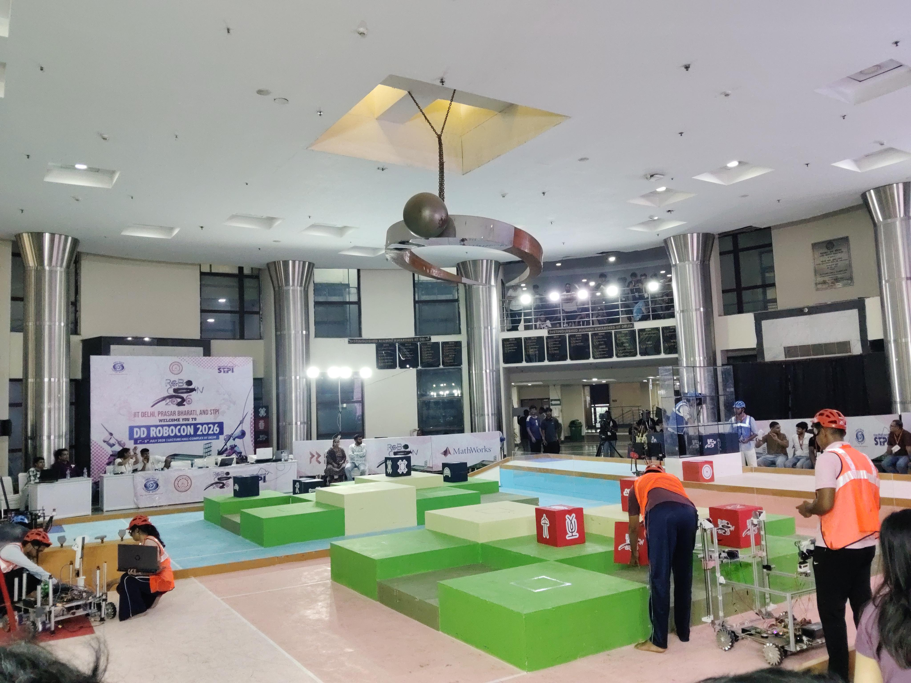

# ABU-Robocon-Work
This repository marks the contribution made by me in the overall journey of Robocon and how did we implemented different ideas into hardware reality. It contain all the methodology implemented by me and how did that helped in the overall dedvelopment of the autonomous bot.

<p align="center">
  
</p>

<h1 align="center">[TEAM NAME] — Robocon Multi-MCU Autonomous Robot</h1>
<p align="center"><i>Built for DD Robocon | Mecanum-drive, FSM-based mission robot</i></p>

<p align="center">
  
  
  
  
  
</p>

---

## 📑 Table of Contents
- [About the Team](#about-the-team)
- [About DD Robocon](#about-dd-robocon)
- [Quick Start](#quick-start)
- [System Architecture](#system-architecture)
- [Hardware Setup](#hardware-setup)
- [Software / Firmware Build & Flash](#software--firmware-build--flash)
- [Running the Robot](#running-the-robot)
- [Missions](#missions)
- [Tech Stack](#tech-stack)
- [Repository Structure](#repository-structure)
- [License](#license)

---

## About the Team

<p align="center">
  
</p>

<!-- TODO: Replace with your team's story -->
We are a student robotics team competing in **DD Robocon**, building a fully autonomous, multi-MCU robot from the ground up — mechanical design, embedded firmware, control systems, and computer vision. This repository documents our robot's architecture, our mission logic, and everything needed to build, flash, and run the system.

> *[One or two lines here about your team's mission/philosophy — e.g. "We build competition robots that are reliable under pressure and engineered like production hardware."]*

---

## About DD Robocon

<p align="center">
  
  
  
  
</p>

<!-- TODO: 3-4 sentence intro to the event -->
**DD Robocon** is a national-level robotics competition that challenges teams to design and build autonomous and manually-operated robots to complete a themed set of missions under strict time and rule constraints. Teams are judged on innovation, reliability, and completion speed on competition day.

---

## Quick Start

```bash
# Clone the repository
git clone https://github.com/<your-username>/<your-repo>.git
cd <your-repo>

# See build instructions per MCU below
```

| Component        | Board              | Role                                   |
|-------------------|---------------------|-----------------------------------------|
| Due A             | Arduino Due          | Primary FSM / mission logic controller |
| Due B / Due C     | Arduino Due / STM32H7 | Motor control, sensor fusion           |
| Vision Unit       | Jetson Orin Nano      | CV pipeline, object detection          |

---

## System Architecture

<!-- TODO: embed or link an architecture diagram, e.g. assets/architecture.png -->
<p align="center">
  
</p>

The robot runs a **multi-MCU architecture**:
- **Due A** — top-level FSM mission controller, coordinates mission sequencing (`WEAPON`, `MEIHUA`, `TICTAC`)
- **Due B / STM32H7** — mecanum wheel kinematics, cascade PID motor control (FreeRTOS)
- **Jetson Orin Nano** — vision pipeline (YOLO / DepthAI), feeds detections upstream

**Inter-MCU communication:** UART and SPI links between Due A, Due B/C, and the vision unit.

---

## Hardware Setup

<!-- TODO: fill with your BOM and assembly steps -->
1. **Chassis assembly** — mecanum wheel base, motor mounts
2. **Wiring** — motor drivers, encoders, IMU, IR/ultrasonic sensors
3. **MCU interconnects** — UART/SPI wiring between Due A ↔ Due B/C ↔ Jetson
4. **Power distribution** — battery, regulators, fusing

| Part | Qty | Notes |
|------|-----|-------|
| Arduino Due | 2–3 | Due A / B / C |
| STM32H7 | 1 | Motor control core |
| Jetson Orin Nano | 1 | Vision/compute |
| Mecanum wheels | 4 | — |
| ... | ... | ... |

---

## Software / Firmware Build & Flash

<!-- TODO: fill in exact toolchain/commands you use -->
```bash
# Example — adjust to your actual build system
# Arduino Due (Due A / mission FSM)
arduino-cli compile --fqbn arduino:sam:arduino_due_x due_a/
arduino-cli upload  -p <PORT> --fqbn arduino:sam:arduino_due_x due_a/

# STM32H7 (motor control)
# Build via STM32CubeIDE / Makefile, flash via ST-Link
```

| Board | Toolchain | Flash Method |
|-------|-----------|--------------|
| Due A/B | Arduino IDE / arduino-cli | USB (native port) |
| STM32H7 | STM32CubeIDE | ST-Link |
| Jetson Orin Nano | ROS2 (Humble) / Python | SSH / direct |

---

## Running the Robot

<!-- TODO: describe your actual startup sequence -->
1. Power on chassis and confirm all MCU heartbeat LEDs
2. Launch vision pipeline on Jetson: `ros2 launch <package> vision.launch.py`
3. Verify UART/SPI link status between Due A and Due B/C
4. Trigger mission start (button / switch / remote command)
5. Monitor FSM state over serial (baud: `<rate>`)

---

## Missions

| Mission | Description |
|---------|--------------|
| **WEAPON** | [Brief mission description] |
| **MEIHUA** | IR-sensor alignment and positioning mission (`meihuaIrAlign()`) |
| **TICTAC** | [Brief mission description] |

---

## Tech Stack

**Languages:** C, C++, Python
**Frameworks/RTOS:** FreeRTOS, ROS2 (Humble)
**Vision:** YOLO (v5/v7/v8), DepthAI, OpenCV
**Control:** Cascade PID, mecanum wheel kinematics, FSM mission logic
**Hardware:** Arduino Due, STM32H7, Jetson Orin Nano

---

## Repository Structure

```
.
├── due_a/            # FSM mission controller firmware
├── due_b/            # Motor control / STM32H7 firmware
├── vision/           # Jetson CV pipeline (ROS2)
├── assets/           # Images used in this README
└── README.md
```

---

## License

This project is licensed under the MIT License — see [LICENSE](LICENSE) for details.

<p align="center"><i>Built with ⚙️ for DD Robocon</i></p>